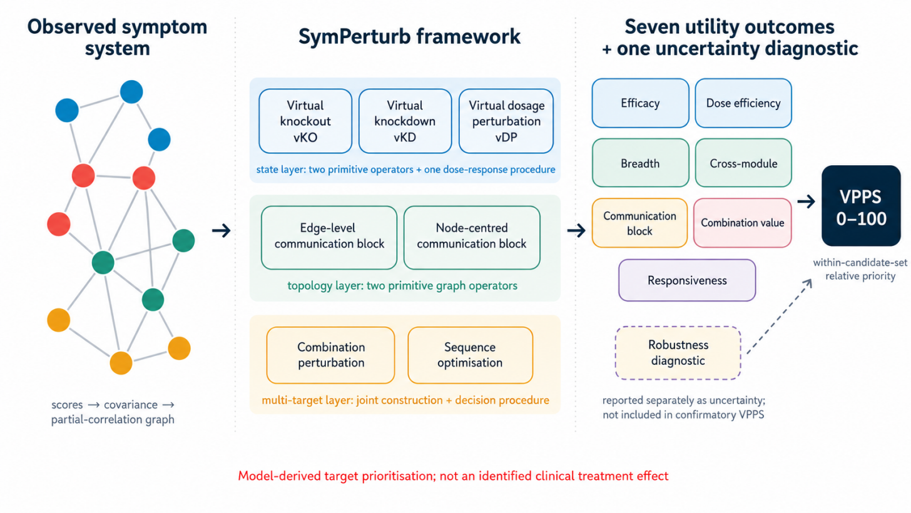

# SymPerturb

[English](README.md) | **简体中文**

**SymPerturb** 是一个用于将拟合后的横断面症状网络转化为明确、可审计、可检验的**虚拟扰动干预靶点假设**的方法学框架。它将状态扰动、拓扑扰动、多靶点分析、七个效用维度、VPPS 排序以及不确定性诊断彼此区分，避免把网络结构指标直接等同于干预价值。

> **科学解释边界：** SymPerturb 不是因果 `do()` 干预估计器，也不能单独证明真实临床治疗效果。横断面无向高斯图模型支持的是“在给定统计模型下，如果施加一个明确的虚拟扰动，系统会如何变化”的模型化问题，而不是已识别的治疗效应。



## 仓库包含什么

本仓库主要面向两类用途：

1. **Agent Skill**：`.agents/skills/symperturb-analysis/` 为英文版 Skill；`.agents/skills/symperturb-analysis-zh/` 为中文版 Skill，可用于辅助设计、执行、审计和解释 SymPerturb 分析。
2. **参考分析程序**：`src/symperturb/` 提供与论文修订版方法学一致的 Python 参考实现。

论文当前版本明确指出，稿件中部分有限样本综合结果仍来自早期八维探索性评分，因此需要按照修订后的**七个效用维度 + 独立 robustness 诊断**重新计算。本仓库以修订后的七维定义作为当前规范。

## 已实现的方法

当前参考实现包括：

- 高斯协方差模型、对角 ridge 正则化和阈值化偏相关邻接矩阵；
- 症状特异性靶点锚点与一般 location–scale 状态扰动；
- 虚拟敲除（vKO）和虚拟敲降（vKD）；
- 虚拟剂量扰动（vDP）；
- 边级 communication blocking 与节点中心 communication blocking；
- 有界量表下的 winsorised-normal 期望；
- 采用共同结局集和有符号增量配对价值的组合扰动；
- 基于显式决策目标的序列优化；
- 七个效用维度：下游效力、剂量效率、广度、跨模块覆盖、communication block、组合价值和响应性；
- 七维 VPPS（候选靶点集合内 min–max 标准化）；
- 与 VPPS 分开报告的 13 个参考敏感性情景 robustness；
- 完整分析流程 bootstrap；
- 可审计的 CSV、JSON、Markdown 和 PNG 输出。

## 安装

```bash
python -m venv .venv
```

Windows：

```bash
.venv\Scripts\activate
pip install -e .
```

macOS / Linux：

```bash
source .venv/bin/activate
pip install -e .
```

运行测试：

```bash
pip install -e ".[dev]"
pytest
```

## 运行自带示例

```bash
symperturb \
  --data examples/synthetic_symptoms.csv \
  --modules examples/modules.csv \
  --anchors examples/anchors.csv \
  --config examples/config.yaml \
  --out example-output
```

仓库中的示例数据仅用于**代码 smoke test 和输出格式演示**，不是论文正式 simulation 数据，也不是患者数据。

## 使用自己的数据

最低需要：

- 症状数据矩阵：每行为一个参与者，每列为一个数值型症状变量；
- 模块文件：至少包含 `symptom,module` 两列。

推荐同时提供：

- `anchors.csv`：`symptom,anchor`；
- `weights.csv`：`symptom,weight`；
- YAML 配置文件：定义量表上下界、状态扰动 map、阈值、拓扑参数、组合规则、bootstrap 次数以及可选的序列目标。

详细说明见 `docs/zh-CN/USER_GUIDE.md`、`docs/zh-CN/METHODS.md` 以及中文版 Skill 的 references。

## 主要输出

`target_scores.csv` 是最重要的靶点层面结果表，应优先报告。它包含：

- 七个原始效用维度；
- 七个 0–100 标准化效用分数；
- VPPS；
- 靶点排序；
- 直接靶点获益；
- 有利下游 spillover；
- 不利下游 spillover。

Robustness 和 bootstrap 结果按设计单独输出，不应混入 confirmatory VPPS。

## Exact vKO 特别提醒

当 exact vKO 将目标症状残余方差设为 0 时，该变量会成为常数列。此时**不能保留该常数列后再进行标准化或重新估计完整协方差矩阵**。

如果研究问题要求获得“敲除后的网络”，应事先明确采用哪一种估计对象：

- 删除目标节点后的 induced network；
- 仅在拓扑层面删除其 incident edges；
- 保留预设小残余方差的 soft vKO。

三者回答的问题不同，必须明确报告。

## VPPS 如何解释

VPPS 是当前预设候选靶点集合内的**相对排序分数**。由于每个效用维度都在当前候选集合中重新进行 min–max 标准化，因此不同队列、不同网络或不同候选集合之间的 VPPS 数值不能直接作为可迁移的临床效用分数比较。

## 结果解释边界

推荐使用：

- “模型推导的优先靶点”
- “虚拟扰动优先级”
- “需要进一步纵向或实验验证的靶点假设”

除非有独立的纵向、实验或临床证据，否则不建议写成：

- “有效治疗靶点”
- “因果靶点”
- “敲除该症状将改善其他症状”

## 可重复性状态

这是根据当前论文方法学规范整理出的**参考实现**。在作为正式发表版本的软件之前，仍建议：

1. 与作者原始研究代码逐项核对；
2. 按七维 VPPS 定义重新生成稿件中的相关数值结果；
3. 进行独立代码审查；
4. 完成完整流程 bootstrap 与模型错设 stress test；
5. 固定正式版本号并归档。

## 引用

见 `CITATION.cff`。在论文 DOI 或正式版本发布前，可同时引用论文题目和本仓库对应版本。

## License

当前生成包尚未替作者选择最终开源许可证。公开发布前请根据作者决定更新根目录 `LICENSE`。
